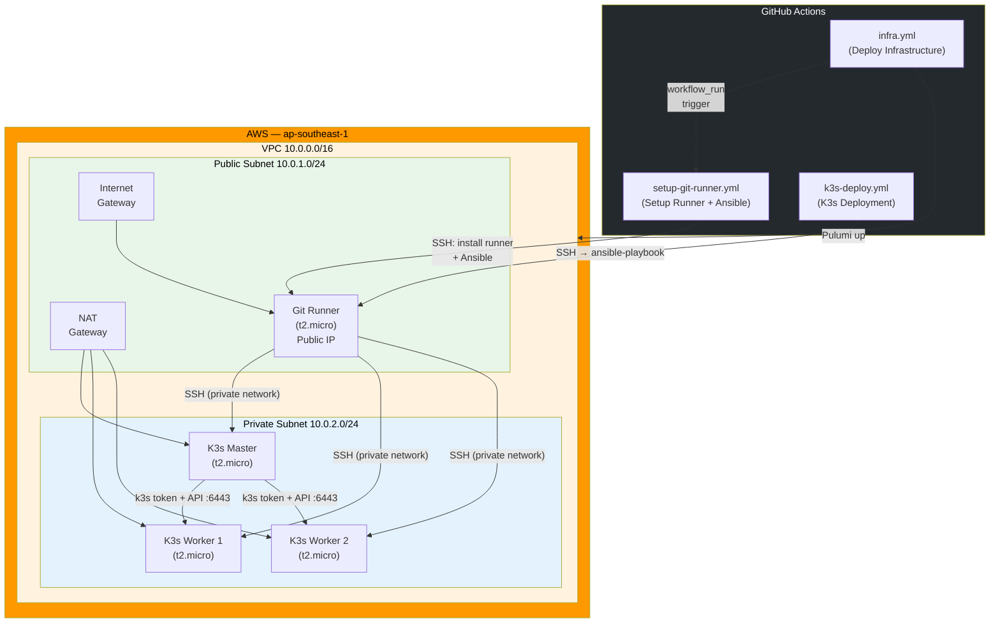
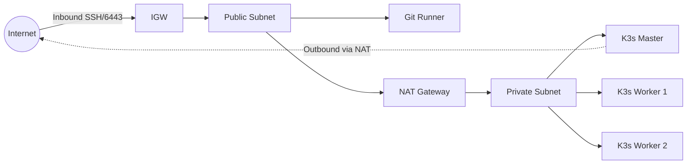
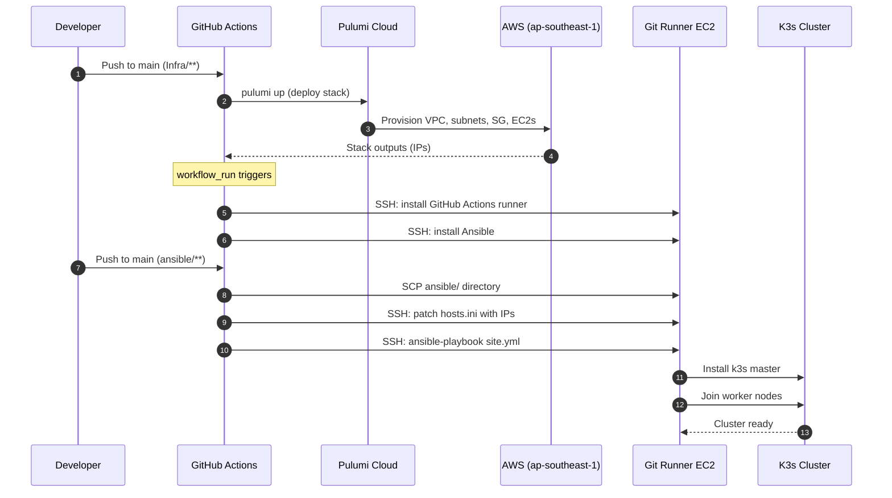

# K3s Cluster on AWS with Pulumi, Ansible & GitHub Actions

Automated infrastructure provisioning and Kubernetes (k3s) cluster deployment on AWS. Uses **Pulumi** for infrastructure-as-code, **Ansible** for configuration management, and **GitHub Actions** for CI/CD orchestration.

---

## Architecture



### Network Flow



---

## CI/CD Pipeline



---

## Project Structure

```
Infra/
├── .github/
│   └── workflows/
│       ├── infra.yml              # Pulumi infrastructure deployment
│       ├── setup-git-runner.yml   # Self-hosted runner + Ansible setup
│       └── k3s-deploy.yml         # K3s cluster deployment via Ansible
├── Infra/
│   ├── __main__.py                # Pulumi program (VPC, EC2, SG, etc.)
│   ├── Pulumi.yaml                # Project metadata
│   ├── Pulumi.dev.yaml            # Dev stack config (region)
│   └── requirements.txt           # Python dependencies (pulumi, pulumi-aws)
├── ansible/
│   ├── ansible.cfg                # Ansible configuration
│   ├── inventory/
│   │   └── hosts.ini              # Dynamic inventory (populated by CI)
│   ├── site.yml                   # Main playbook
│   └── roles/
│       ├── common/
│       │   └── tasks/main.yml     # System updates + base packages
│       ├── k3s-master/
│       │   └── tasks/main.yml     # k3s server install + token export
│       └── k3s-worker/
│           └── tasks/main.yml     # k3s agent join cluster
└── README.md
```

---

## Technologies

| Technology | Purpose |
|---|---|
| **Pulumi** (Python) | Infrastructure-as-Code — provisions all AWS resources |
| **AWS EC2** | Compute — 4 instances (1 master, 2 workers, 1 runner) |
| **AWS VPC** | Networking — public/private subnets, NAT, IGW, routing |
| **k3s** | Lightweight Kubernetes distribution |
| **Ansible** | Configuration management — installs and joins k3s nodes |
| **GitHub Actions** | CI/CD — orchestrates provisioning and deployment |

---

## Infrastructure Resources

Pulumi provisions the following resources in **ap-southeast-1**:

| Resource | Name | Details |
|---|---|---|
| VPC | `my-vpc` | `10.0.0.0/16`, DNS enabled |
| Public Subnet | `public-subnet` | `10.0.1.0/24`, auto-assign public IP |
| Private Subnet | `private-subnet` | `10.0.2.0/24` |
| Internet Gateway | `internet-gateway` | Attached to VPC |
| NAT Gateway | `nat-gateway` | In public subnet, with Elastic IP |
| Security Group | `k3s-secgrp` | Inbound: SSH (22), k3s API (6443) |
| EC2 — Master | `Master Node` | `t2.micro`, private subnet |
| EC2 — Worker 1 | `Worker Node 1` | `t2.micro`, private subnet |
| EC2 — Worker 2 | `Worker Node 2` | `t2.micro`, private subnet |
| EC2 — Runner | `Git Runner` | `t2.micro`, public subnet |
| Key Pair | `my-key-pair` | From `PUBLIC_KEY` env variable |

---

## Prerequisites

- **AWS Account** with programmatic access (access key + secret key)
- **Pulumi Account** with an access token ([app.pulumi.com](https://app.pulumi.com))
- **SSH Key Pair** — public key for EC2, private key for Ansible/CI
- **GitHub Repository** with Actions enabled

---

## GitHub Secrets

Configure these secrets in your repository settings (**Settings > Secrets and variables > Actions**):

| Secret | Description |
|---|---|
| `AWS_ACCESS_KEY_ID` | AWS IAM access key |
| `AWS_SECRET_ACCESS_KEY` | AWS IAM secret access key |
| `PULUMI_ACCESS_TOKEN` | Pulumi service access token |
| `PUBLIC_KEY` | SSH public key (injected into EC2 key pair) |
| `SSH_PRIVATE_KEY` | SSH private key (used by Ansible to reach nodes) |
| `RUNNER_TOKEN` | GitHub Actions runner registration token |

---

## How It Works

### 1. Infrastructure Provisioning (`infra.yml`)

Triggered on push to `main` when files in `Infra/**` change.

- Sets up Python, installs Pulumi + AWS SDK
- Configures AWS credentials and SSH public key
- Runs `pulumi up` to create/update all AWS resources
- Exports instance IPs as workflow outputs

### 2. Runner & Ansible Setup (`setup-git-runner.yml`)

Triggered automatically after the **Deploy Infrastructure** workflow completes.

- Retrieves instance IPs from Pulumi stack outputs
- SSHs into the Git Runner EC2 instance
- Downloads and registers the GitHub Actions self-hosted runner
- Installs Ansible on the runner instance

### 3. K3s Deployment (`k3s-deploy.yml`)

Triggered on push to `main` when files in `ansible/**` change.

- Retrieves instance IPs from Pulumi stack outputs
- Copies the `ansible/` directory and SSH key to the Git Runner
- Patches `hosts.ini` with dynamic private IPs via `sed`
- Runs `ansible-playbook site.yml` from the runner, which:
  - **common**: Updates apt, installs `curl`, `wget`, and TLS packages
  - **k3s-master**: Installs k3s server, exports the cluster join token
  - **k3s-worker**: Joins each worker to the master using the token and API endpoint

---

## Ansible Roles

### `common`
Updates system packages and installs base dependencies on all cluster nodes.

### `k3s-master`
Installs k3s in server mode using the official install script. Registers the join token and master IP as Ansible facts for worker nodes.

### `k3s-worker`
Joins the k3s cluster as an agent using the master's API endpoint (`https://<master-ip>:6443`) and the join token retrieved from the master node.

---

## Local Development

```bash
# Clone the repository
git clone https://github.com/<your-org>/Infra.git
cd Infra

# Set up Pulumi
cd Infra
python -m venv venv
source venv/bin/activate
pip install -r requirements.txt

# Configure stack
pulumi stack init dev
pulumi config set aws:region ap-southeast-1

# Deploy (requires AWS credentials and PUBLIC_KEY env var)
export PUBLIC_KEY="ssh-rsa AAAA..."
pulumi up
```

---

## Stack Outputs

After a successful `pulumi up`, the following outputs are available:

| Output | Description |
|---|---|
| `git_runner_public_ip` | Public IP of the GitHub Actions runner EC2 |
| `master_private_ip` | Private IP of the k3s master node |
| `worker1_private_ip` | Private IP of k3s worker node 1 |
| `worker2_private_ip` | Private IP of k3s worker node 2 |

```bash
pulumi stack output git_runner_public_ip
pulumi stack output master_private_ip
```

---

## Troubleshooting

### `TypeError: Eip._internal_init() got an unexpected keyword argument 'vpc'`

**Cause:** The `vpc=True` argument was removed in `pulumi-aws` v7.

**Fix:** Replace `vpc=True` with `domain="vpc"`:

```python
# Before (broken in v7+)
eip = ec2.Eip('nat-eip', vpc=True)

# After
eip = ec2.Eip('nat-eip', domain="vpc")
```

---

### `pulumi:pulumi:Stack ... create error: Program failed with an unhandled exception`

**Cause:** A Python runtime error in `__main__.py` (e.g., wrong argument, missing import, or API change).

**Fix:** Read the full traceback in the diagnostics output — it will point to the exact line and error. Common causes:

- Outdated argument names (check the [Pulumi AWS changelog](https://github.com/pulumi/pulumi-aws/blob/master/CHANGELOG.md))
- Missing `pulumi_aws` version pinned in `requirements.txt`
- Using deprecated resource classes (e.g., `s3.Bucket` instead of `s3.BucketV2`)

---

### `Http response code: NotFound from 'POST https://api.github.com/actions/runner-registration'`

**Cause:** The GitHub Actions runner registration token is expired or invalid. Tokens expire within ~1 hour of generation.

**Fix:** Dynamically fetch a fresh token in your workflow instead of hardcoding it:

```bash
TOKEN=$(curl -s -X POST \
  -H "Authorization: token $GH_PAT" \
  -H "Accept: application/vnd.github+json" \
  https://api.github.com/repos/<owner>/<repo>/actions/runners/registration-token \
  | jq -r .token)

./config.sh --url https://github.com/<owner>/<repo> --token $TOKEN --unattended
```

Store your PAT (classic, with `repo` scope) as a secret named `GH_PAT`.

---

### `sudo: ./svc.sh: command not found`

**Cause:** The `svc.sh` script is being called from the wrong directory. It only exists inside the `actions-runner/` folder.

**Fix:** Make sure you `cd` into the runner directory before calling it:

```bash
cd ~/actions-runner
sudo ./svc.sh install
sudo ./svc.sh start
```

---

## License

This project is provided as-is for educational and development purposes.
